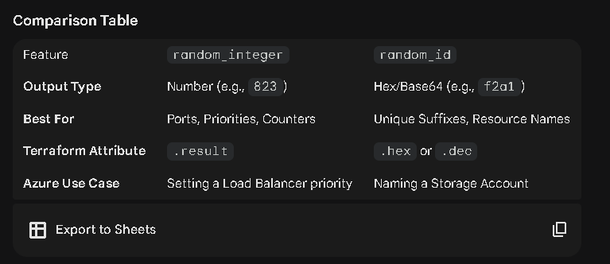
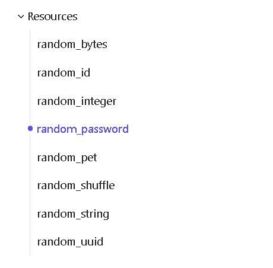

Why I recommended random_id instead::
-->
For Azure naming, random_id is usually "better" than random_integer for three reasons:

#Hexadecimal Formatting: random_id provides a .hex output (e.g., a1b2c3d4). Hex strings look more "professional" in resource names than just a string of numbers.

#Entropy (Uniqueness): A byte_length = 4 generates a much wider range of possible values than a simple 4 or 5-digit integer, which significantly reduces the chance of a "name collision" in Azure.

#Azure Compatibility: Azure Storage accounts and Key Vaults have strict rules (no special characters).
#Hexadecimal strings from random_id always fit these rules perfectly.
s

# USE RANDOMS_ID FOR AZURE SECURE RESOURCE NAMING
